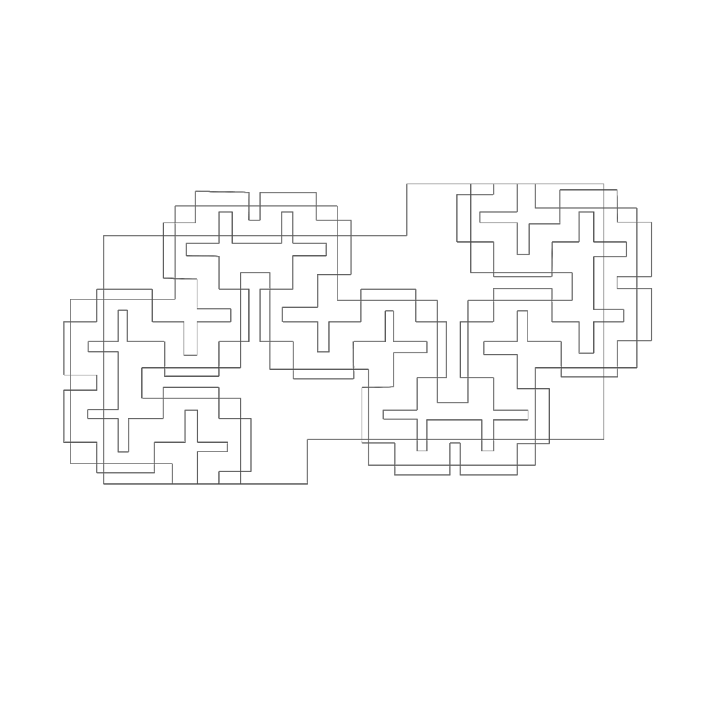

# Model

The model synthesizes spatial and data analysis into structured representations of urban systems.

## Spatial Timeline

  

    

    

      

      

      

    

  

  

    
Map

    

    

  

### Graphs
Relational representation of spatial elements and their connections.  
→ [Graphs](graphs.md)

This is a sample network graph showing relationships between actors, events, and places. The actual graph will be rendered using the data from `events.json`, `actors.json`, and `places.json`.

### Patterns
Identification and abstraction of recurring spatial and architectural configurations.  
→ [Patterns](patterns.md)

  

    

      
    

    
Morphological

    
Analysis of urban form, street patterns, building density, and spatial structure.

  

  

    

      
    

    
Architectural

    
Study of building typologies, construction styles, and architectural evolution.

  

  

    

      
    

    
Functional

    
Examination of land use distribution, activity centers, and urban functionality.

  

<!-- Display of cards for Patterns -->

## Approach

- Graph-based modeling  
- Pattern extraction  
- Rule-based systems  
- Computational representation  

## Objective

Translate urban complexity into structured models for analysis, comparison, and simulation.